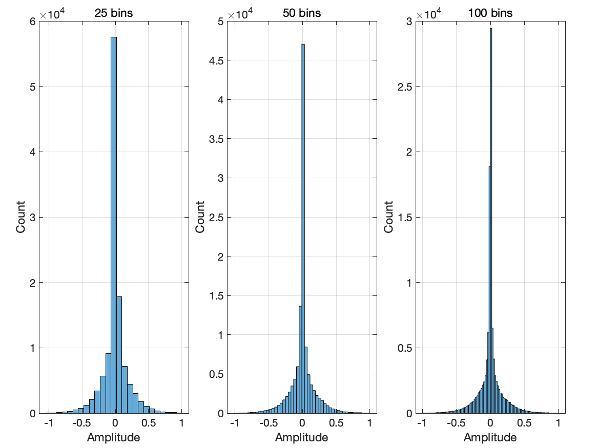
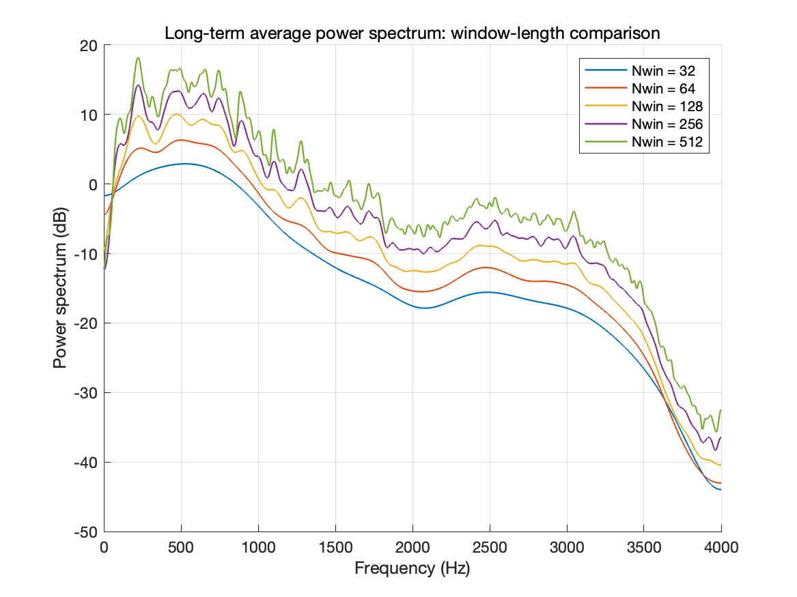
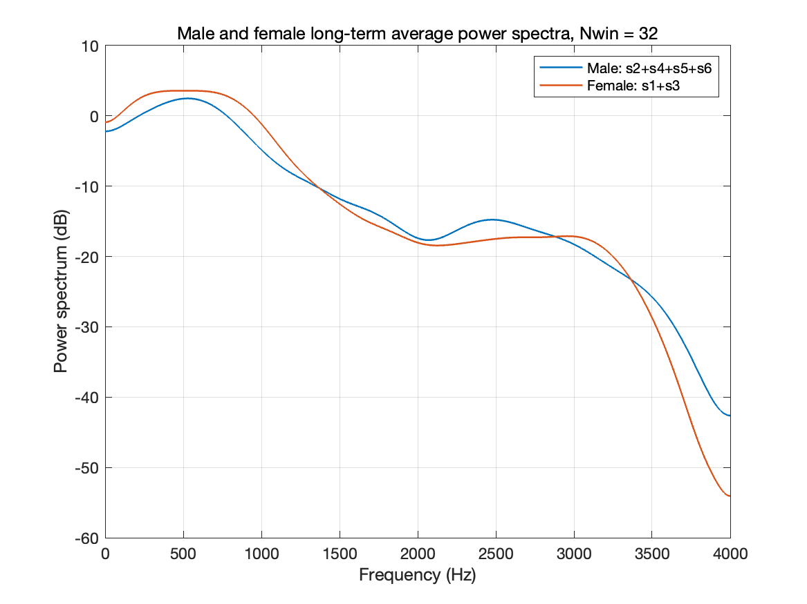
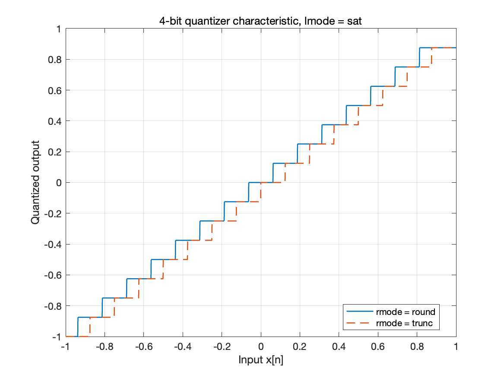
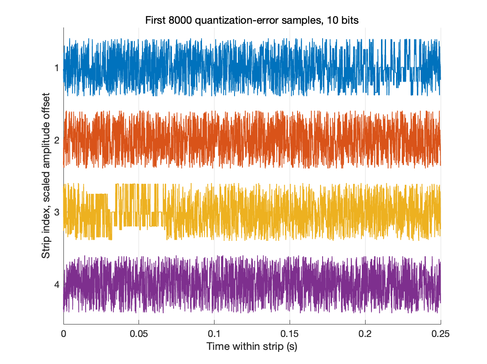
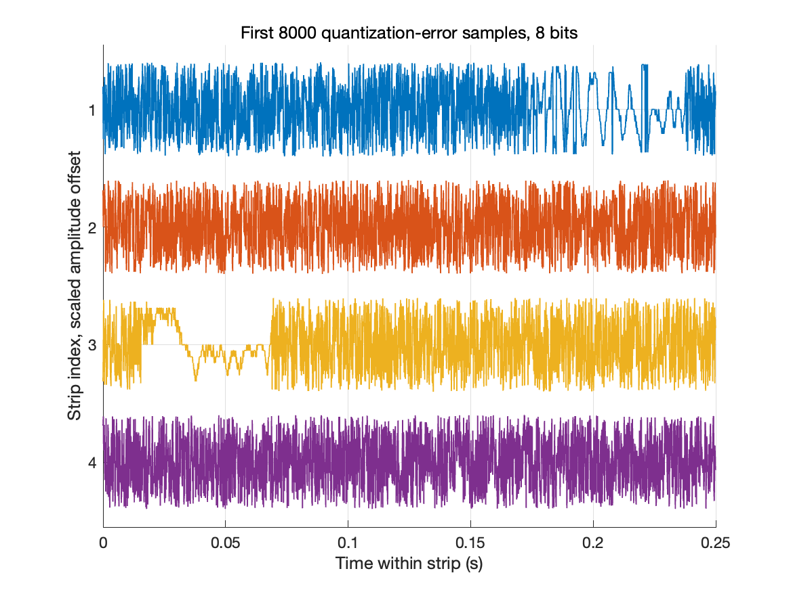
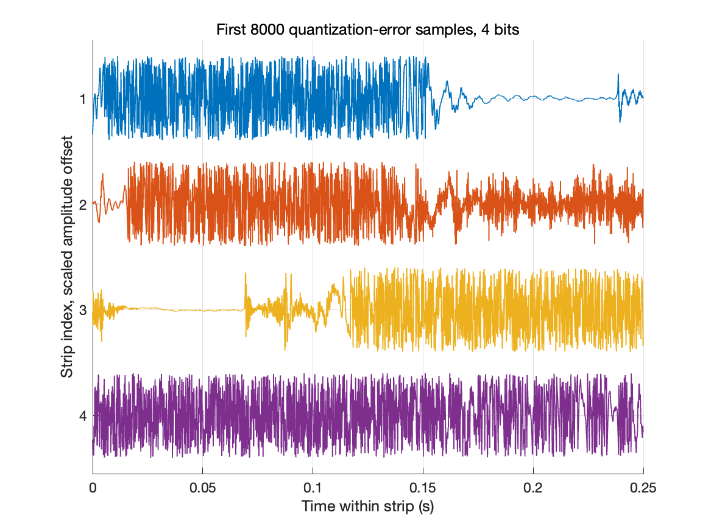
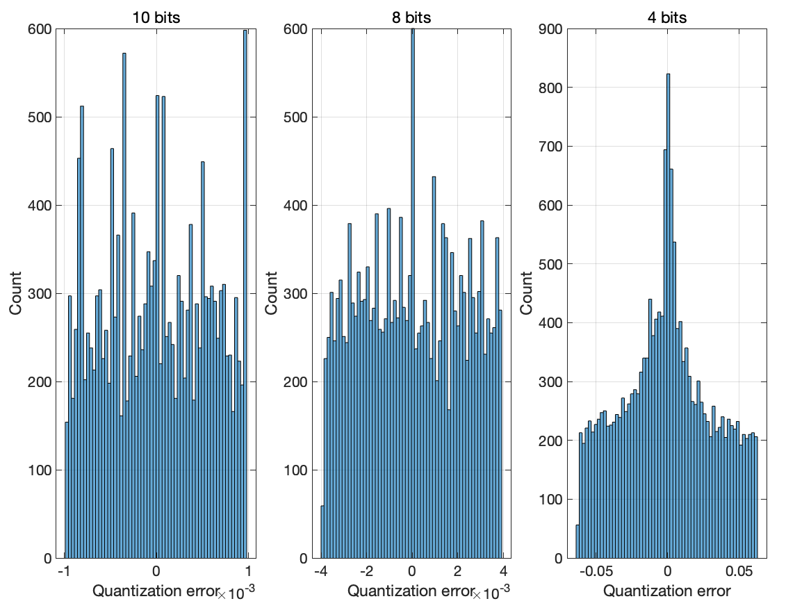
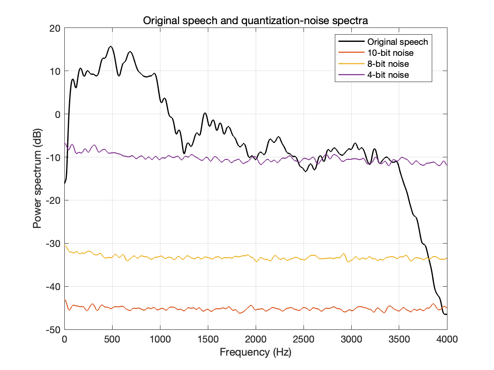

# 一、实验目的

本实验围绕语音信号的统计建模与均匀量化展开，主要目标如下：

1. 对多个语音文件进行端点静音去除与拼接，观察语音幅度的统计分布；
2. 利用长时平均功率谱分析窗长对谱平滑程度的影响；
3. 比较男性语音与女性语音的平均功率谱差异；
4. 利用 `fxquant` 验证均匀量化器特性，分析量化误差的时域、直方图和频域特性。

# 二、实验代码

本次完成的 MATLAB 文件如下：

- `lab9_problem1.m`：完成 Problem 1 的语音拼接、统计量、直方图和功率谱分析；
- `lab9_problem2.m`：完成 Problem 2 的量化器特性、量化误差和噪声功率谱分析；
- `strips.m`：实现题目要求的分行波形显示函数；

# 三、Problem 1：语音统计模型

## 3.1 拼接语音文件

按题目要求，先对每个输入语音文件去除开头和结尾的静音段，再生成三个拼接文件：

1. `out_s1_s6.wav = s1 + s2 + s3 + s4 + s5 + s6`；
2. `out_male.wav = s2 + s4 + s5 + s6`；
3. `out_female.wav = s1 + s3`。

其中采样率均为 8000 Hz。

## 3.2 Problem 1(a)：统计量与幅度直方图

以 `out_s1_s6.wav` 作为大样本语音源，得到如下统计量：

| 统计量 | 数值 |
|---|---:|
| 样本数 | 117593 |
| 时长 | 14.699125 s |
| 均值 | 0.0001464778 |
| 方差 | 0.0300428120 |
| 最小值 | -0.9999694824 |
| 最大值 | 0.9999694824 |



从直方图可以看出，语音幅度样本高度集中在零附近，幅度越大出现概率越低，整体符合语音信号常见的尖峰、长尾分布特征。直方图峰值的含义是：在对应幅度区间内的样本数最多；对于 100 bins 情况，最高柱通常对应接近零幅度的中心区间，说明“接近静音或低幅度”的采样点占比最高。25 个 bins 可以反映整体分布形状；增加到 50 或 100 个 bins 后，分布细节更清楚，但曲线起伏也更明显。

补充说明：去静音方式不同、拼接版本不同，也会改变精确零值样本数量，从而影响中心峰值高度。

## 3.3 Problem 1(b)：窗长对长时平均功率谱的影响

使用 `pspect(s, fs, Nfft, Nwin)` 对 `out_s1_s6.wav` 估计长时平均功率谱。实验中使用 `Nfft = 2048` 作零填充，并比较 `Nwin = 32, 64, 128, 256, 512` 五种窗长。



观察结果如下：

- 短窗包含样本较少，时间局部性更强，频谱曲线起伏较明显；
- 长窗包含更多样本，平均效果更强，谱估计更平滑；
- 不同窗长下整体谱包络趋势一致，语音能量主要集中在低频区域，随频率升高功率整体下降。

## 3.4 Problem 1(d)：男性与女性语音功率谱比较

按题目要求，使用 `Nwin = 32` 分别计算 `out_male.wav` 与 `out_female.wav` 的长时平均功率谱，并画在同一张图中。



比较结果如下：

- 男性语音通常基频更低，因此低频区域能量更突出；
- 女性语音通常基频更高，谱峰相对向较高频率移动；
- 两类语音在整体包络上仍表现为低频能量较强、高频能量逐渐衰减。

# 四、Problem 2：均匀量化

## 4.1 Problem 2(a)：4-bit 量化器特性

构造输入向量

$$
x_{in}=-1:0.001:1
$$

分别使用 `bits = 4`、`lmode = 'sat'`，比较 `rmode = 'round'` 与 `rmode = 'trunc'` 的量化器输入输出特性。



当使用截断量化 `rmode = 'trunc'` 时，误差定义为

$$
e[n] = \hat{x}[n] - x[n]
$$

实验得到误差范围为：

$$
e[n] \in [-0.1250000000,\ 0.0000000000]
$$

这是因为 4-bit 定点量化步长为 \(d = 2^{-(4-1)} = 0.125\)，截断方式总是向较小量化电平取整，因此误差主要落在一个量化步长以内的非正区间。

## 4.2 Problem 2(b)：s5.wav 语音量化误差

按题目要求，取 `s5.wav` 的第 1300 到 18800 个样本，使用

```matlab
rmode = 'round';
lmode = 'sat';
```

分别进行 10-bit、8-bit 和 4-bit 量化。对每种量化器，计算量化误差序列，并使用 `strips(x, sd, fs)` 画出前 8000 个误差样本，其中每行 2000 个样本，即 `sd = 2000/fs`。







量化误差的数值结果如下：

| 量化位数 | 噪声方差 | SNR |
|---:|---:|---:|
| 10 bits | 3.1540065293e-07 | 50.242752 dB |
| 8 bits | 4.94253385225e-06 | 38.291433 dB |
| 4 bits | 0.00100197492654 | 15.220733 dB |

误差直方图如下：



结果分析：

- 量化位数越高，量化步长越小，误差幅度和噪声方差越小；
- 10-bit 误差最小，8-bit 误差明显增大，4-bit 误差最大且在时域上最容易观察；
- 误差直方图在 10-bit 与 8-bit 时更接近均匀分布，较符合白量化噪声假设；
- 4-bit 量化过粗，误差与语音信号相关性更明显，直方图对均匀分布模型的符合程度下降。

## 4.3 Problem 2(c)：量化噪声功率谱

使用 `pspect()` 计算 10-bit、8-bit、4-bit 量化误差序列的功率谱，并与原始未量化语音样本的功率谱画在同一张图中。



结果分析：

- 量化噪声谱相对平坦，尤其在较高量化位数时更支持白噪声近似；
- 原始语音功率谱具有明显频率结构，而量化噪声谱的频率选择性弱得多；
- 4-bit 噪声功率显著高于 8-bit 和 10-bit，低位数量化造成明显失真；
- 10-bit 与 8-bit 噪声谱的平均差值为 `-11.927765 dB`，即 8-bit 噪声谱大约比 10-bit 高 `11.927765 dB`。

理论上，均匀量化每增加 1 bit，量化信噪比约提高 6 dB。因此 10-bit 比 8-bit 多 2 bit，噪声功率约应降低 12 dB；本实验得到约 11.93 dB，与理论值吻合良好。

# 五、结论

1. 语音幅度分布集中在零附近，并具有明显尖峰和长尾特征；
2. 长时平均功率谱中，增大窗长会提高谱估计平滑程度，但整体语音谱包络趋势不变；
3. 男性语音低频能量相对更突出，女性语音谱成分相对偏高；
4. 量化位数越低，量化噪声越大，SNR 明显下降；
5. 对 10-bit 和 8-bit 量化，量化噪声较接近白噪声模型；4-bit 量化误差更大且模型符合程度下降；
6. 10-bit 与 8-bit 量化噪声谱差约 11.93 dB，与每 bit 约 6 dB 的理论规律一致。
